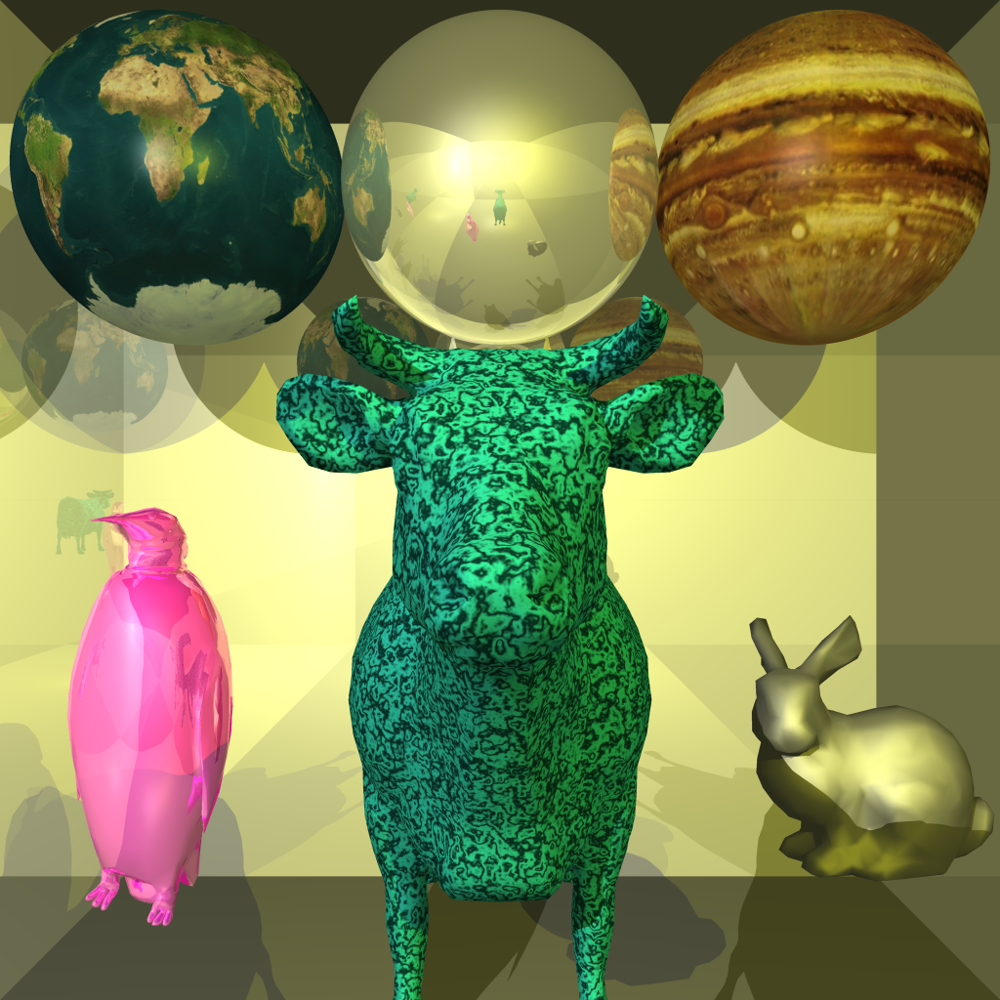

# Ray Tracer

## Features

* Custom scene description language (see `scenes/`)
* Support for the SMF model format (a subset of the OBJ format)
* Acceleration via multithreading and a bounding volume hierarchy
* Antialiasing via adaptive supersampling
* Sphere, plane, and cylinder primitives
* Reflections and refractions
* Spherical texture mapping and procedural marble texturing

## Example

Below is a rendering of `scenes/textures.txt`.

